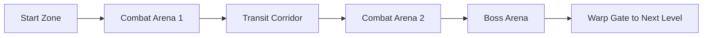
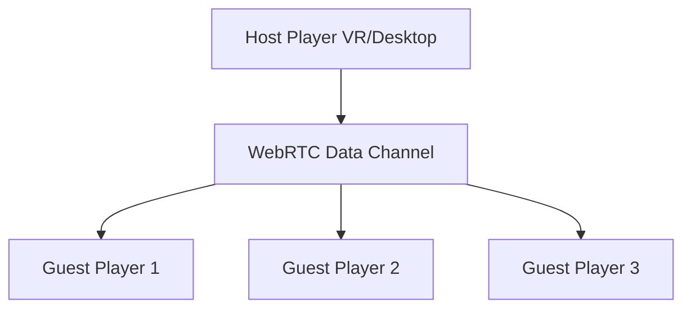

# Space Zombie Arcade - Spielkonzept

## Überblick
Ein kooperatives Arcade-Weltraum-Shooter-Spiel, bei dem 1-4 Spieler stationäre Miniguns in einem Raumschiff bedienen, um Wellen von Weltraum-Zombies abzuwehren, während sie durch prozedural generierte Level fliegen.

## Core Gameplay Loop

### Hauptmechaniken
- **Stationäre Turret-Positionen**: Jeder Spieler kontrolliert eine fest montierte Minigun
- **360° Sichtfeld**: Spieler können sich umschauen und in alle Richtungen zielen
- **Auto-Pilot Raumschiff**: Das Schiff bewegt sich automatisch durch das Level
- **Wellen-basierte Gegner**: Zombies nähern sich aus verschiedenen Richtungen

## Spielmodi

### 1. Einzelspieler
- Eine Minigun-Position (frontal)
- Reduzierte Zombie-Anzahl
- KI-gesteuerte Hilfsgeschütze bei kritischen Momenten

### 2. Lokaler Koop (2-4 Spieler)
- **2 Spieler**: Links/Rechts Positionen
- **3 Spieler**: Links/Rechts/Hinten
- **4 Spieler**: Links/Rechts/Vorne/Hinten
- Geteilte Punktzahl und gemeinsame Leben

## Gegnertypen

### Basis-Zombies
1. **Walker Zombie**: Langsam, wenig HP, kommt in Gruppen
2. **Runner Zombie**: Schnell, mittlere HP, zigzag Bewegung
3. **Tank Zombie**: Sehr langsam, hohe HP, absorbiert Schaden
4. **Spitter Zombie**: Mittlere Geschwindigkeit, spuckt Projektile

### Boss-Zombies
- **Mega Zombie**: Erscheint am Ende jedes Levels
- **Swarm Mother**: Spawnt kleinere Zombies
- **Kamikaze Zombie**: Explodiert bei Kontakt mit dem Schiff

## Power-Ups System

### Waffen-Upgrades
- **Rapid Fire**: Erhöhte Feuerrate für 15 Sekunden
- **Explosive Rounds**: Flächenschaden für 10 Sekunden  
- **Laser Beam**: Durchdringender Strahl für 8 Sekunden
- **Freeze Bullets**: Verlangsamt getroffene Gegner

### Defensive Power-Ups
- **Shield Boost**: Temporärer Schild um das Schiff
- **Time Slow**: Verlangsamt alle Gegner für 5 Sekunden
- **Auto-Turret**: Spawnt temporäre KI-Geschütze

## Level-Design

### Prozedurale Generation

### Umgebungen
1. **Asteroiden-Feld**: Zombies verstecken sich hinter Asteroiden
2. **Verlassene Raumstation**: Enge Korridore mit vielen Angriffswinkeln
3. **Nebula**: Eingeschränkte Sicht, Zombies erscheinen aus dem Nebel
4. **Weltraum-Friedhof**: Zerstörte Schiffe als Deckung für Zombies

## Progression System

### Level-Struktur
- 5 Level pro "Sektor"
- Boss-Kampf am Ende jedes Sektors
- Schwierigkeit steigt mit jedem Level
- Checkpoint-System nach jedem Level

### Scoring
- Punkte für jeden eliminierten Zombie
- Combo-Multiplikator für schnelle Kills
- Bonus für Präzision (Headshots)
- Team-Bonus für synchrone Kills

## Technische Umsetzung

### Basis-Technologie
- **Three.js** für 3D-Grafik
- **WebXR** für VR-Support
- **IWER** für Desktop-Emulation
- **Gamepad-Wrapper** für Controller-Support

### Netzwerk-Architektur (für lokales Koop)

### Performance-Optimierung
- Object Pooling für Zombies und Projektile
- LOD-System für entfernte Objekte
- Frustum Culling für nicht sichtbare Elemente
- Instanced Rendering für mehrere gleiche Zombies

## Audio Design

### Sound-Effekte
- Minigun-Feuer (unterschiedliche Variationen)
- Zombie-Geräusche (Stöhnen, Schreie)
- Treffer-Feedback
- Power-Up Aktivierung
- Alarm bei kritischem Schiffszustand

### Musik
- Dynamische Intensität basierend auf Gegnerdichte
- Boss-Kampf-Themen
- Sieg-Fanfare

## UI/UX Design

### HUD-Elemente
- Munitionsanzeige
- Schiffs-Gesundheit
- Aktive Power-Ups
- Combo-Counter
- Wave-Fortschritt
- Radar (zeigt Gegner-Positionen)

### VR-spezifische Features
- Haptisches Feedback beim Schießen
- 3D-Audio für Gegner-Positionierung
- Natürliches Zielen mit VR-Controllern
- Kopfbewegung zum Umschauen

## Monetarisierung (Optional)

### Free-to-Play Modell
- Basis-Spiel kostenlos
- Kosmetische Skins für Waffen
- Neue Umgebungen als DLC
- Season Pass mit exklusiven Power-Ups

## Entwicklungs-Roadmap

### Phase 1: Prototyp (MVP)
- Einzelspieler-Modus
- Eine Minigun-Position
- Basis-Zombietypen
- Ein prozedurales Level
- Grundlegende Power-Ups

### Phase 2: Koop-Integration
- Lokaler Multiplayer
- Mehrere Turret-Positionen
- Verbesserte Zombie-KI
- Mehr Level-Variationen

### Phase 3: Content-Erweiterung
- Boss-Kämpfe
- Alle Power-Up-Typen
- Komplettes Progression-System
- Achievements

### Phase 4: Polish
- Optimierung
- Erweiterte Effekte
- Leaderboards
- Tutorial-Modus

## Inspiration & Referenzen
- **Sailors Quest VR**: Stationäre Shooter-Mechanik
- **Space Pirate Trainer**: Wave-basierte Arena
- **Arizona Sunshine**: Zombie-Shooter in VR
- **Galaga**: Klassische Arcade-Progression

Absolut. Hier ist ein detailliertes Game Design Document (GDD), das einer KI als umfassende Anleitung zur Entwicklung des WebXR-Spiels "Tiefsee-Drachen-Odyssee" dienen kann.

Game Design Document: Tiefsee-Drachen-Odyssee

Version: 1.0
Datum: 4. September 2025
Projekt-Codename: DragonRideXR

1. Executive Summary

"Tiefsee-Drachen-Odyssee" ist ein kooperativer On-Rail-Shooter für die WebXR-Plattform. Spieler reiten auf fliegenden Meeresdrachen durch visuell beeindruckende Wasser- und Höhlenlandschaften und bekämpfen Wellen von feindlichen Kreaturen. Das Gameplay ist auf schnelle, arcade-ähnliche Action und intuitive Steuerung ausgelegt. Den Höhepunkt jedes Levels bildet ein epischer Kampf gegen ein riesiges Seeungeheuer. Das Spiel wird mit Web-Technologien (vorzugsweise A-Frame oder Three.js) entwickelt, um maximale Zugänglichkeit ohne Installation auf gängigen VR-Brillen zu gewährleisten.

2. Spielkonzept & Vision

Genre: VR On-Rail-Shooter, Arcade-Action

Zielplattform: WebXR (optimiert für Standalone-VR-Brillen wie Meta Quest 2/3, Pico 4)

Zielgruppe: Casual- bis Mid-Core-VR-Spieler, die schnelle Action und kooperative Erlebnisse mögen.

Kernvision: Ein sofort zugängliches, visuell fesselndes VR-Erlebnis schaffen, das den Nervenkitzel von Seeschlachten und Monsterjagden aus dem Referenzvideo einfängt und in ein leicht verständliches Arcade-Format übersetzt. Der Fokus liegt auf dem "Flow-State" des ununterbrochenen Schießens und dem befriedigenden Gefühl, gemeinsam mit einem Partner übermächtige Feinde zu besiegen.

3. Gameplay-Mechaniken
3.1. Core-Gameplay-Loop

Reiten & Zielen: Der Spieler bewegt sich automatisch auf einer vordefinierten Route (on-rails) durch das Level. Seine Hauptaufgabe ist das Zielen und Schießen auf Feinde.

Kämpfen: Wellen von Gegnern erscheinen aus verschiedenen Richtungen. Der Spieler muss sie abschießen, bevor sie Schaden anrichten können.

Sammeln: Besiegte Gegner lassen Power-Ups fallen, die kurzzeitig die Waffen verbessern.

Überleben: Spieler müssen den Angriffen von Gegnern und den finalen Bossen ausweichen (durch Kopfbewegung oder kleine, vorgegebene Ausweichmanöver des Drachen).

Bosskampf: Am Ende des Levels konfrontiert der Spieler einen riesigen Boss mit spezifischen Schwachpunkten.

Punkten & Wiederholen: Spieler erhalten Punkte für besiegte Gegner und Boni für Genauigkeit und Effizienz. Ein Highscore-System motiviert zum Wiederspielen.

3.2. Steuerung (VR-Controller)

Zielen: Die Blickrichtung des Spielers und die Ausrichtung der VR-Controller steuern das Fadenkreuz der beiden an den Drachen montierten Kanonen. Jeder Controller steuert eine Kanone.

Schießen: Der Trigger-Button am jeweiligen Controller löst einen Schuss aus. Gedrückt halten für Dauerfeuer.

Power-Up-Aktivierung: (Optional) Eine dedizierte Taste (z. B. Grip-Button) könnte ein gesammeltes Power-Up aktivieren.

3.3. Waffen & Power-Ups

Standard-Kanone: Feuert schnelle, einzelne Projektile. Überhitzt bei zu langem Dauerfeuer (visuelle und auditive Anzeige).

Power-Ups (Dauer: 15 Sekunden):

Streuschuss: Feuert drei Projektile in einem fächerförmigen Muster. Ideal gegen Schwärme.

Laserstrahl: Ein kontinuierlicher Energiestrahl, der hohen Schaden verursacht.

Raketenwerfer: Feuert langsamere, aber flächenschädigende Raketen ab.

Schild: Ein temporärer Energieschild, der eine begrenzte Anzahl von Treffern absorbiert.

4. Gegnerdesign

"Himmels-Piranhas" (Schwarmgegner): Kleine, fliegende Fischmonster, die in großen Gruppen angreifen und schnelle, aber schwache Projektile verschießen.

"Höhlen-Fledermäuse" (Agile Gegner): Ähnlich wie im Referenzvideo. Greifen schnell und in unvorhersehbaren Mustern an. Weichen Schüssen aus.

"Gepanzerte Krabben" (Tank-Gegner): Langsame, stark gepanzerte Kreaturen, die auf Felsen sitzen und gezielte, starke Energiestöße abfeuern. Ihr Panzer muss erst zerstört werden.

Boss: "Der Kraken-Titan": Ein riesiges Seeungeheuer, das aus der Tiefe aufsteigt.

Angriffe: Schlägt mit Tentakeln, verschießt Tinte, um die Sicht zu behindern, und beschwört kleinere Helfer-Gegner.

Schwachpunkte: Leuchtende Energieknoten an den Tentakeln und am Kopf. Müssen in einer bestimmten Reihenfolge zerstört werden.

5. Leveldesign & Spielwelt

Visueller Stil: Inspiriert vom Video – eine Mischung aus Steampunk-Ästhetik (Drachenkanonen), Fantasy (Kreaturen) und einer mystischen, nebligen Naturkulisse mit imposanten Wasserfällen, leuchtenden Kristallen und antiken Ruinen.

Level 1: Die vergessene Bucht

Abschnitt 1: Flug durch eine offene Bucht mit Felsinseln und Wasserfällen. Gegner sind primär "Himmels-Piranhas".

Abschnitt 2: Übergang in ein Höhlensystem. Hier tauchen "Höhlen-Fledermäuse" und "Gepanzerte Krabben" auf. Die Umgebung wird enger und erfordert präziseres Zielen.

Abschnitt 3 (Boss-Arena): Eine große Unterwasserkaverne, in der der Kampf gegen den "Kraken-Titan" stattfindet.

6. Benutzeroberfläche (UI) & User Experience (UX)

In-Game-HUD: Minimalistisch und an der Waffe oder im Cockpit des Drachensattels integriert.

Gesundheitsanzeige: Eine visuelle Anzeige (z. B. Risse im Bildschirm oder eine leuchtende Leiste).

Punkteanzeige: Oben im Sichtfeld, gut lesbar.

Überhitzungsanzeige: Die Kanonenrohre beginnen rot zu glühen.

Power-Up-Status: Ein Symbol zeigt das aktive Power-Up und seine verbleibende Dauer an.

Feedback: Klares visuelles und auditives Feedback ist entscheidend.

Treffer-Feedback: Gegner leuchten kurz auf, wenn sie getroffen werden. Ein "Hitmarker"-Soundeffekt wird abgespielt.

Schadens-Feedback: Der Bildschirmrand färbt sich rot, wenn der Spieler getroffen wird. Ein dumpfer Aufprallton ist zu hören.

Explosionen: Besiegte Gegner explodieren in befriedigenden Partikeleffekten.

7. Grafik & Sound

Grafik: Low-Poly-Modelle mit hochwertigen Texturen und Effekten, um eine hohe Framerate (Ziel: 72-90 FPS) zu gewährleisten. Wichtige Effekte sind:

Wasser-Shader (realistische Reflektionen und Gischt).

Partikeleffekte für Schüsse, Einschläge und Explosionen.

Volumetrischer Nebel und God-Rays (Lichtstrahlen), um Tiefe und Atmosphäre zu erzeugen.

Sound:

Soundeffekte: Kräftige, befriedigende Schussgeräusche, unterschiedliche Explosionsklänge je nach Gegnertyp, Schreie der Monster.

Musik: Ein orchestraler, epischer Soundtrack, der sich dynamisch der Spielsituation anpasst (ruhiger während der Erkundung, intensiv während der Kämpfe).

Räumlicher Klang (3D-Audio): Wichtig, damit Spieler die Richtung von Angriffen hören können.

8. Technische Spezifikationen

Engine/Framework: A-Frame oder Three.js. A-Frame wird für einen schnelleren Prototyping-Prozess empfohlen, da es eine Entity-Component-System-Architektur bietet.

Multiplayer: Implementierung eines Zwei-Spieler-Koop-Modus. WebSockets oder WebRTC können für die Netzwerkkommunikation genutzt werden, um die Positionen, Schüsse und den Spielstatus der beiden Spieler zu synchronisieren.

Physik: Minimaler Einsatz von Physik, da es ein On-Rail-Shooter ist. Hauptsächlich für Projektile und Partikeleffekte.

Performance: Strikte Budgetierung von Polygonen und Draw Calls. Einsatz von "Baking" für Beleuchtung und Schatten, wo möglich, um die Echtzeitberechnung zu minimieren.