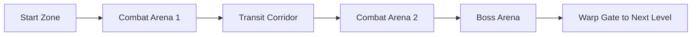
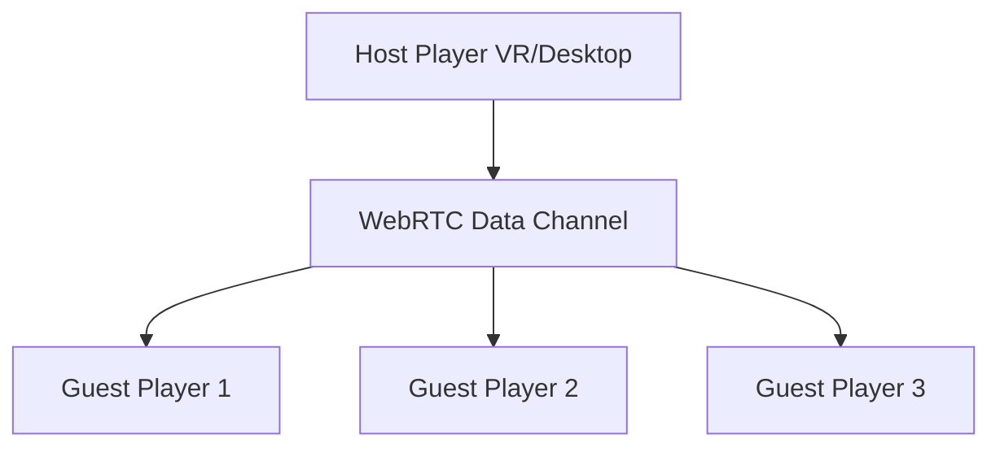

# Space Zombie Arcade - Spielkonzept

## Überblick
Ein kooperatives Arcade-Weltraum-Shooter-Spiel, bei dem 1-4 Spieler stationäre Miniguns in einem Raumschiff bedienen, um Wellen von Weltraum-Zombies abzuwehren, während sie durch prozedural generierte Level fliegen.

## Core Gameplay Loop

### Hauptmechaniken
- **Stationäre Turret-Positionen**: Jeder Spieler kontrolliert eine fest montierte Minigun
- **360° Sichtfeld**: Spieler können sich umschauen und in alle Richtungen zielen
- **Auto-Pilot Raumschiff**: Das Schiff bewegt sich automatisch durch das Level
- **Wellen-basierte Gegner**: Zombies nähern sich aus verschiedenen Richtungen

## Spielmodi

### 1. Einzelspieler
- Eine Minigun-Position (frontal)
- Reduzierte Zombie-Anzahl
- KI-gesteuerte Hilfsgeschütze bei kritischen Momenten

### 2. Lokaler Koop (2-4 Spieler)
- **2 Spieler**: Links/Rechts Positionen
- **3 Spieler**: Links/Rechts/Hinten
- **4 Spieler**: Links/Rechts/Vorne/Hinten
- Geteilte Punktzahl und gemeinsame Leben

## Gegnertypen

### Basis-Zombies
1. **Walker Zombie**: Langsam, wenig HP, kommt in Gruppen
2. **Runner Zombie**: Schnell, mittlere HP, zigzag Bewegung
3. **Tank Zombie**: Sehr langsam, hohe HP, absorbiert Schaden
4. **Spitter Zombie**: Mittlere Geschwindigkeit, spuckt Projektile

### Boss-Zombies
- **Mega Zombie**: Erscheint am Ende jedes Levels
- **Swarm Mother**: Spawnt kleinere Zombies
- **Kamikaze Zombie**: Explodiert bei Kontakt mit dem Schiff

## Power-Ups System

### Waffen-Upgrades
- **Rapid Fire**: Erhöhte Feuerrate für 15 Sekunden
- **Explosive Rounds**: Flächenschaden für 10 Sekunden  
- **Laser Beam**: Durchdringender Strahl für 8 Sekunden
- **Freeze Bullets**: Verlangsamt getroffene Gegner

### Defensive Power-Ups
- **Shield Boost**: Temporärer Schild um das Schiff
- **Time Slow**: Verlangsamt alle Gegner für 5 Sekunden
- **Auto-Turret**: Spawnt temporäre KI-Geschütze

## Level-Design

### Prozedurale Generation

### Umgebungen
1. **Asteroiden-Feld**: Zombies verstecken sich hinter Asteroiden
2. **Verlassene Raumstation**: Enge Korridore mit vielen Angriffswinkeln
3. **Nebula**: Eingeschränkte Sicht, Zombies erscheinen aus dem Nebel
4. **Weltraum-Friedhof**: Zerstörte Schiffe als Deckung für Zombies

## Progression System

### Level-Struktur
- 5 Level pro "Sektor"
- Boss-Kampf am Ende jedes Sektors
- Schwierigkeit steigt mit jedem Level
- Checkpoint-System nach jedem Level

### Scoring
- Punkte für jeden eliminierten Zombie
- Combo-Multiplikator für schnelle Kills
- Bonus für Präzision (Headshots)
- Team-Bonus für synchrone Kills

## Technische Umsetzung

### Basis-Technologie
- **Three.js** für 3D-Grafik
- **WebXR** für VR-Support
- **IWER** für Desktop-Emulation
- **Gamepad-Wrapper** für Controller-Support

### Netzwerk-Architektur (für lokales Koop)

### Performance-Optimierung
- Object Pooling für Zombies und Projektile
- LOD-System für entfernte Objekte
- Frustum Culling für nicht sichtbare Elemente
- Instanced Rendering für mehrere gleiche Zombies

## Audio Design

### Sound-Effekte
- Minigun-Feuer (unterschiedliche Variationen)
- Zombie-Geräusche (Stöhnen, Schreie)
- Treffer-Feedback
- Power-Up Aktivierung
- Alarm bei kritischem Schiffszustand

### Musik
- Dynamische Intensität basierend auf Gegnerdichte
- Boss-Kampf-Themen
- Sieg-Fanfare

## UI/UX Design

### HUD-Elemente
- Munitionsanzeige
- Schiffs-Gesundheit
- Aktive Power-Ups
- Combo-Counter
- Wave-Fortschritt
- Radar (zeigt Gegner-Positionen)

### VR-spezifische Features
- Haptisches Feedback beim Schießen
- 3D-Audio für Gegner-Positionierung
- Natürliches Zielen mit VR-Controllern
- Kopfbewegung zum Umschauen

## Monetarisierung (Optional)

### Free-to-Play Modell
- Basis-Spiel kostenlos
- Kosmetische Skins für Waffen
- Neue Umgebungen als DLC
- Season Pass mit exklusiven Power-Ups

## Entwicklungs-Roadmap

### Phase 1: Prototyp (MVP)
- Einzelspieler-Modus
- Eine Minigun-Position
- Basis-Zombietypen
- Ein prozedurales Level
- Grundlegende Power-Ups

### Phase 2: Koop-Integration
- Lokaler Multiplayer
- Mehrere Turret-Positionen
- Verbesserte Zombie-KI
- Mehr Level-Variationen

### Phase 3: Content-Erweiterung
- Boss-Kämpfe
- Alle Power-Up-Typen
- Komplettes Progression-System
- Achievements

### Phase 4: Polish
- Optimierung
- Erweiterte Effekte
- Leaderboards
- Tutorial-Modus

## Inspiration & Referenzen
- **Sailors Quest VR**: Stationäre Shooter-Mechanik
- **Space Pirate Trainer**: Wave-basierte Arena
- **Arizona Sunshine**: Zombie-Shooter in VR
- **Galaga**: Klassische Arcade-Progression